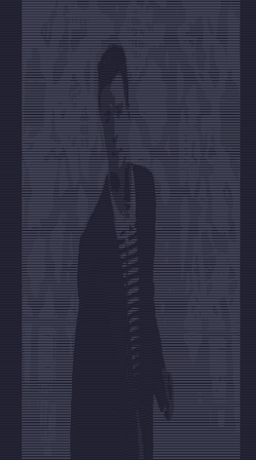

# Video to ASCII Art Converter
A command line-tool written in Rust to convert video files into ASCII art and play them directly in your terminal.



## Features
- Processes video files frame-by-frame.
- Maps each frame's pixel lightness to an ASCII character.
- Plays the resulting ASCII animation in the terminal at a specified FPS.

## Prerequisites
   To run or build this project, you must have the following installed on your system:
1. Rust: This project is built using the Rust programming language. You can install it from [rustup.rs](https://www.rustup.rs)
2. FFmpeg: This project depends on the FFmpeg libraries to decode video files.
  - On macOS (with Homebrew):
    ```Bash
    brew install ffmpeg
    ```
  - On Arch Linux:
    ```Bash
    sudo pacman -Syu ffmpeg
    ```
  - On Debian / Ubuntu:
    ```Bash
    sudo apt-get update && sudo apt-get install libavutil-dev
    ```
  - On Fedora / CentOS:
    ```Bash
    sudo dnf install ffmpeg-devel
    ```

## Installation & Build
1. Clone the repository to your local machine:
  ```Bash
  git clone https://github.com/mcmodder123/vid_to_ascii
  cd vid_to_ascii
  ```
2. Build the project in release mode for the best performance:
  ```Bash
  cargo build --release
  ```
  The final executable will be located at `./target/release/vid_to_ascii`.

## Usage
1. Turn down your font size, and run the program from your terminal by providing the path to a video file and the desired FPS as arguments as shown below.
Syntax:
`./target/release/vid_to_ascii <path-to-video> <fps>`
Example:
```Bash
./target/release/vid_to_ascii "my_awesome_video.mp4" 24
```
Note: This program works best with low resolution videos.

## License
This project is licensed under the [GNU General Public License version 3](./LICENSE).
